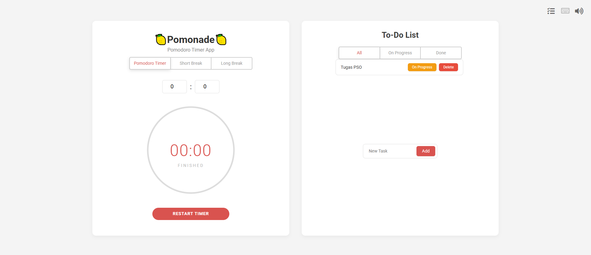

# POMONADE: A POMONADE TIMER🍋

## Kelompok 12:

- Silfia Mei Wulandari (5026221073)
- Widyantari Nuriyanti (5026221137)
- Sheva Aulia (5026221145)



## 🍋 Deskripsi Aplikasi

Aplikasi timer dengan menerapkan metode pomodoro yaitu 25 menit bekerja secara aktif serta istirahat antar sesi. Waktu istirahat dapat dipilih sesuai dengan kebutuhan pengguna, terdapat pilihan Istirahat Sebentar dan Istirahat Lama.

Aplikasi ini diambil melalui forking source pada github https://github.com/luizbatanero/pomodoro-react. Perubahan fitur yang dilakukan adalah menambahkan custom lama waktu untuk bekerja secara aktif sehingga bisa disesuaikan dengan keinginan pengguna.

## 🧰 Tools yang Digunakan

Kami memanfaatkan tools berikut dalam membuat Pipeline CI/CD untuk aplikasi Pomonode:
- AWS (Amazon Web Services): Menjalankan aplikasi container dari Docker Hub via ECS tanpa perlu mengatur server manual. Mendukung deployment yang scalable dan terkelola.
- GitHub Actions: Otomatisasi CI/CD langsung dari GitHub. Memicu build, test, dan deployment setiap ada commit atau pull request.
- ESLint: Linter untuk kode JavaScript. Menjaga kualitas dan konsistensi kode dengan deteksi error otomatis di pipeline CI/CD.
- Vitest: Framework testing modern untuk proyek berbasis Vite. Memastikan kestabilan dan kebenaran fungsi aplikasi.
- Docker: Platform untuk membungkus aplikasi dan dependensinya dalam container yang portabel dan konsisten. Menghindari masalah perbedaan environment.
- AWS CloudWatch: Layanan monitoring dari AWS untuk mengawasi metrik, log, dan performa aplikasi serta infrastruktur. Membantu mendeteksi error, memantau resource, dan mengatur notifikasi otomatis bila terjadi gangguan.

## 🛠️ Instalasi Aplikasi

- Clone repository:
```bash
git clone https://github.com/widyantari/DevOpsPomo.git
```

- Masuk ke directory dan install dependencies :
```bash
cd DevOpsPomo && npm install
```

- Jalankan aplikasi:
```bash
npm run start
```

## 🌩️ Tahap Pengaturan Cloud

### 1. Buat Akun Pengguna IAM untuk GitHub Actions

Untuk memungkinkan GitHub Actions berinteraksi dengan AWS, buat pengguna IAM khusus:

- Buka **AWS Console > IAM > Users > Add users**
- Isi nama pengguna, contoh: `DevOpsPomo`
- Pilih tipe akses: **Programmatic access**
- Lampirkan policy berikut:
  - `AmazonEC2ContainerRegistryPowerUser`
  - `AmazonECS_FullAccess`
  - `IAMReadOnlyAccess`
- Selesaikan pembuatan, lalu **catat Access Key ID dan Secret Access Key**

---

### 2. Membuat Peran untuk ECS

Agar ECS dapat menjalankan task, buat IAM Role:

- Buka **IAM > Roles > Create role**
- Pilih trusted entity: **AWS Service**
- Cari dan pilih: **Elastic Container Service**
- Lanjutkan dan selesaikan pembuatan role
- Nama role akan menjadi: `AWSServiceRoleForECS` (default)

---

### 3. Membuat Klaster ECS

Klaster adalah tempat ECS service dijalankan:

- Buka **ECS > Clusters > Create Cluster**
- Pilih template: **AWS Fargate**
- Isi nama klaster, misalnya: `devopspomo-cluster`  
  (harus sama dengan `ECS_CLUSTER_NAME` di `cicd.yml`)
- Gunakan pengaturan VPC default
- Klik **Create**

---

### 4. Membuat Definisi Tugas (Task Definition)

Mendefinisikan cara menjalankan container:

- Buka **ECS > Task Definitions > Create new Task Definition**
- Pilih launch type: **Fargate**
- Nama definisi tugas: `devopspomo-service`  
  (harus sama dengan `ECS_SERVICE_NAME`)
- Execution role: **Buat peran baru** → otomatis jadi `ecsTaskExecutionRole`
- Task size:
  - Memory: `0.5 GB`
  - vCPU: `0.25 vCPU`
- Tambahkan kontainer:
  - **Name**: `devopspomo-container` (sesuai `CONTAINER_NAME`)
  - **Image**: `widyantari/pomonade:latest`
  - **Port mapping**: `80`
- Klik **Create**

---

### 5. Membuat ECS Service & Application Load Balancer (ALB)

Service menjaga task tetap berjalan, dan ALB mendistribusikan trafik:

- Dari Task Definition, klik **Create Service**
- **Konfigurasi Service**:
  - Cluster: `devopspomo-cluster`
  - Launch type: `Fargate`
  - Task Definition: `devopspomo-service`
  - Service name: `devopspomo-service`
  - Desired tasks: `1`

- **Konfigurasi Jaringan**:
  - VPC: default
  - Subnet: pilih minimal 2 **public subnet**
  - Security Group: buat baru `devopspomo-sg`
    - Tambahkan rule: HTTP (port 80) dari `0.0.0.0/0`
  - Load Balancer: pilih **Application Load Balancer**
  - Buat ALB: `devopspomo-alb`
  - Buat Target Group: `devopspomo-tg` (protocol HTTP, port 80)

- **Autoscaling**: pilih **Do not configure autoscaling**

---

## PSO A
